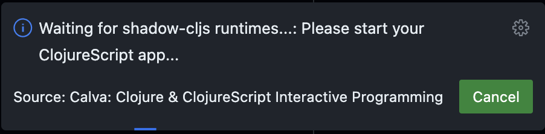

# Calva Power Tools

TBD...

## Development

The paved path is:

1. `npm run watch`. This starts Clojure with an nREPL server.
   * Wait for it to report something like:
     ```
     nREPL server started on port 56749 on host localhost - nrepl://localhost:56749
     ```
1. <kbd>ctrl+alt+c ctrl+alt+c</kbd>. This runs the command: **Calva: Connect to a Running REPL Server in the Project**
   * It will connect the Clojure REPL, start a ClojureScript (shadow-cljs) REPL, and build the extension.
   * This will compile the extension and run the tests. Wait for the **Build+watch extension** to show that the tests have ran, and for Calva to pop up a progress dialog looking something like so:
     
   * Hint: _The ClojureScript app is your extension_.
1. <kbd>F5</kbd>. This starts the VS Code _Development Extension Host_ (because configured to do so in [.vscode/launch.json](.vscode/launch.json))
   * The development extension host is a VS Code window where your extension under development is installed. You now need to activate it to actually start the ClojureScript app.
   * The extension auto-activates, **now your ClojureScript app and its REPL is started 🎉**
1. Back in the development project you will see the progress dialog go away. Because now the development project window is connected to the Development Extension Host window's REPL.
      * Now you can hack on the extension code, which will update the app in the extension host window while it is running (a.k.a. interactive programming).

An important thing to note here is the steps where you activate your extension in the development host, starting the ClojureScript repl which Calva can connect to.


## Contributing commands to the extension

TBD...

## License

MIT

Free to use, modify and redistribute as you wish. 🍻🗽
