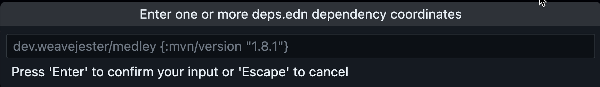
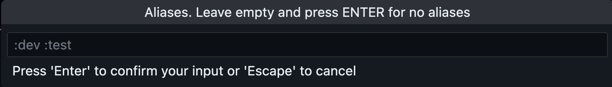

# Calva Power Tools

A VSCode extension, and [Calva](https://calva.io) companion, for Clojure and ClojureScript development that adds commands for popular Clojure libraries and tools.

## Supported Tools

* [tools-deps](https://clojure.org/guides/deps_and_cli) for dependency management.
* [Clay](https://scicloj.github.io/clay/) for literate programming and data visuallization.

## Usage

1. Install the extension from the [VSCode Marketplace](https://marketplace.visualstudio.com/items?itemName=BetterThanTomorrow.calva-power-tools).
1. Open the command palette with <kbd>ctrl+shift+p</kbd> or <kbd>cmd+shift+p</kbd>.
1. Start typing to fuzzy search for commands. E.g. `Clay` to see the available Clay commands.

### Default keybindings included

The Calva Power Tools extension generally contributes default keybindings for the commands. They are all chained on a first chord of <kbd>ctrl+shift+space</kbd>, a.k.a. the **Power Key**. Then, generally, each tool has its key, e.g. **Clay** uses the **Tool Key** <kbd>a</kbd>, making Clay commands executed with <kbd>ctrl+shift+space</kbd> <kbd>a</kbd> <kbd>something</kbd>.

### Tools-deps, add-libs

A set of commands leveraging Clojure 1.12 `add-libs`:

* **tools-deps: Load Dependencies...**: Will prompt for and load dependencies.
   
* **tools-deps: Load Selected Dependencies**): Add one or more deps.edn dependencies coordinate that you have selected in the editor. E.g. if you have added it to your `deps.edn` file and want to load the dependency without restarting your REPL (or you may have some comment in the code with the dependency coordinates): Select the key-value pair(s) for the dependencies and then run this command.
* **tools-deps: Sync deps.edn Dependencies...**: Sync (load any missing)
 dependencies in `deps.edn`. Prompts for aliases.
   

**Tool Key**: <kbd>d</kbd>

### Clay

Explore the Clay commands from the VS Code command palette by fuzzy searching “Clay”.
Also check this intoduction out: https://www.youtube.com/watch?v=B1yPkpyiEEs

**Tool Key**: <kbd>a</kbd>

## Rationale

Users access IDE functionality via commands and the command palette, but tools and libraries cannot add these to VSCode except via an extension.
Calva Power Tools is a contributor friendly way for library and tool authors to provide commands in VSCode without making a separate extension.

## Contributing

Issues and pull requests are welcome. Please see [CONTRIBUTING](CONTRIBUTING.md)

## Adding a new command

1. Add the command name and title in [package.json](package.json).
   * The command name should be unique and follow the format `<library>.<command>`.
   * The title should be a human-readable name for the command.
   * The command should be added to the `contributes.commands` array.
2. Add keybindings for the command in [package.json](package.json) (optional).
   * The keybinding should be added to the `contributes.keybindings` array.
3. Add clojure snippets they should invoke in [src/calva_power_tools/tool](src/calva_power_tools/tool) (see [src/calva_power_tools/tool/clay.cljs](src/calva_power_tools/tool/clay.cljs) for an example).
   * Fully qualify symbols in snippets to avoid uninitialized namespace issues
4. Register them in [src/extension.cljs](src/extension.cljs) in the `activate` function.

## Development

The paved path is:

1. `npm run watch`. This starts Clojure with an nREPL server. (You can run the build task command inside VSCode).
   * Wait for it to report something like:
     ```
     nREPL server started on port 56749 on host localhost - nrepl://localhost:56749
     ```
1. <kbd>ctrl+alt+c ctrl+alt+c</kbd>. This runs the command: **Calva: Connect to a Running REPL Server in the Project**
   * It will connect the Clojure REPL, start a ClojureScript (shadow-cljs) REPL, and build the extension.
   * This will compile the extension and run the tests. Wait for the **Build+watch extension** to show that the tests have ran, and for Calva to pop up a progress dialog looking something like so:
     
   * Hint: _The ClojureScript app is your extension_.
1. <kbd>F5</kbd>. This starts the VS Code _Development Extension Host_ (because configured to do so in [.vscode/launch.json](.vscode/launch.json))
   * The development extension host is a VS Code window where your extension under development is installed. You now need to activate it to actually start the ClojureScript app.
   * The extension auto-activates, **now your ClojureScript app and its REPL is started 🎉**
1. Back in the development project you will see the progress dialog go away. Because now the development project window is connected to the Development Extension Host window's REPL.
      * Now you can hack on the extension code, which will update the app in the extension host window while it is running (a.k.a. interactive programming).

An important thing to note here is the steps where you activate your extension in the development host, starting the ClojureScript repl which Calva can connect to.

## License

MIT

Free to use, modify and redistribute as you wish. 🍻🗽

## Built VSC-ET, the VS Code Extension Template

* https://github.com/PEZ/vscode-extension-template