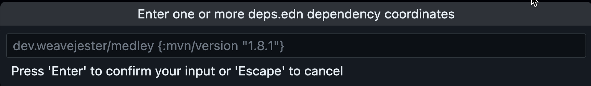
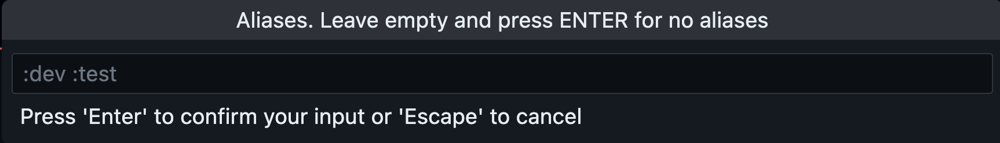
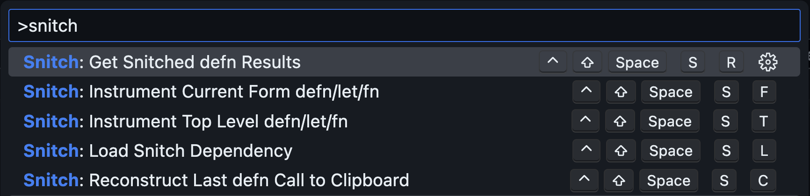
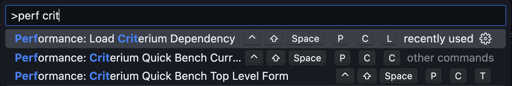
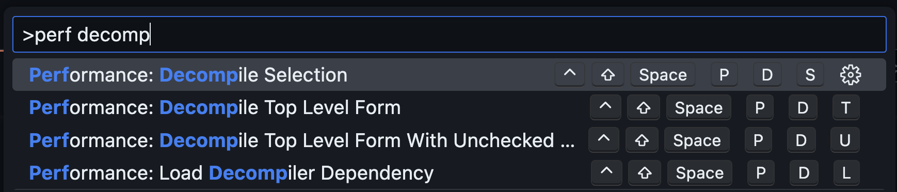
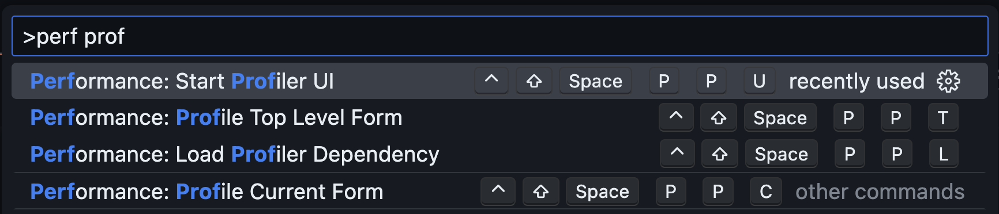
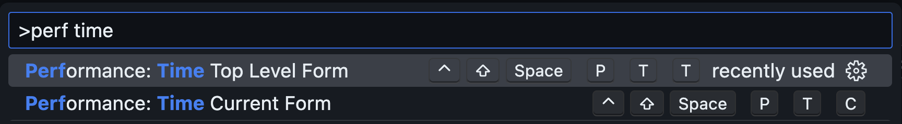
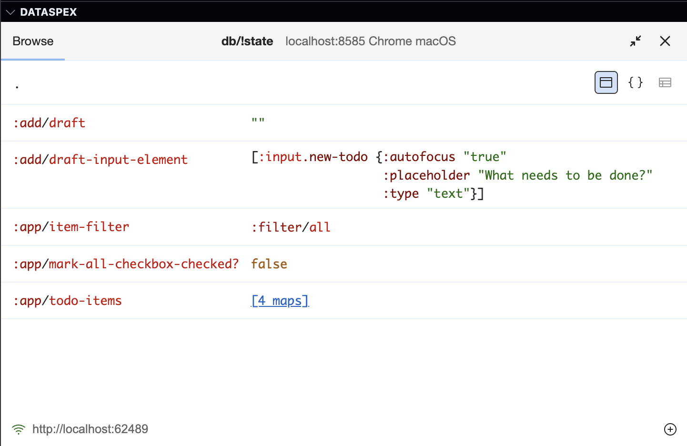
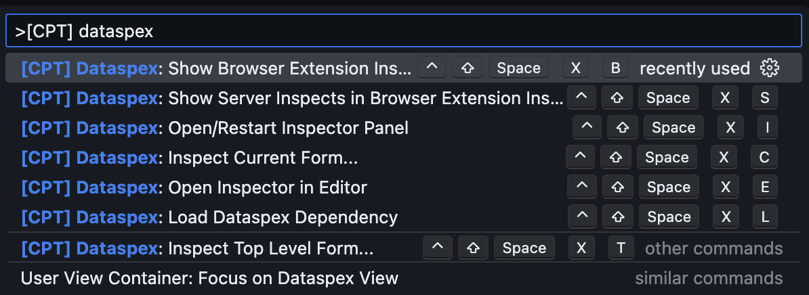

# Calva Power Tools

A VSCode extension, and [Calva](https://calva.io) companion, for Clojure and ClojureScript development that adds commands for popular Clojure libraries and tools. Including commands for dynamically loading the tool dependencies.

## Usage

1. Install the extension from the [VSCode Marketplace](https://marketplace.visualstudio.com/items?itemName=BetterThanTomorrow.calva-power-tools).
1. The commands are available from the command palette. There is a default keybinding for filtering the palette on the Calva Power Tools commands: <kbd>ctrl+shift+space ctrl+shift+space</kbd>.

There is a quick demo/howto here: https://youtu.be/GiWKX-0NqkM

### Default keybindings included

The Calva Power Tools extension generally contributes default keybindings for the commands. They are all chained on a first chord of <kbd>ctrl+shift+space</kbd>, a.k.a. the **Power Key**. Then, generally, each tool has its key, e.g. **Snitch** uses the **Tool Key** <kbd>s</kbd>. You can thus execute Snitch commands with <kbd>ctrl+shift+space</kbd> <kbd>s</kbd> <kbd>something</kbd>.

There are also default bindings for filtering the command palette on a specific tool. Generally the <kbd>ctrl+shift+space</kbd> <kbd>ctrl+shift+tool-key</kbd>. E.g. to list the Snitch commands:

* <kbd>ctrl+shift+space</kbd> <kbd>ctrl+shift+s</kbd>

## The Tools

A hopefully growing list of power tools.

### Tools-deps, add-libs

* [tools-deps](https://clojure.org/guides/deps_and_cli)

A set of commands leveraging Clojure 1.12 `add-libs`:

* **tools-deps: Load Dependencies...**: Will prompt for and load dependencies.
   
* **tools-deps: Load Selected Dependencies**): Add one or more deps.edn dependencies coordinate that you have selected in the editor. E.g. if you have added it to your `deps.edn` file and want to load the dependency without restarting your REPL (or you may have some comment in the code with the dependency coordinates): Select the key-value pair(s) for the dependencies and then run this command.
* **tools-deps: Sync deps.edn Dependencies...**: Sync (load any missing)
 dependencies in `deps.edn`. Prompts for aliases.
   

**Tool Key**: <kbd>d</kbd>

### Clay

* [Clay](https://scicloj.github.io/clay/)

**Tool Key**: <kbd>a</kbd>

Explore the Clay commands from the VS Code command palette by fuzzy searching “Clay”.
Also check this intoduction out: https://www.youtube.com/watch?v=B1yPkpyiEEs

### Snitch

Snitch is inline-defs on steroids. See https://github.com/AbhinavOmprakash/snitch. Search the command palette for “Snitch”.

**Tool Key**: <kbd>s</kbd>



This menu screenshot is showing the default key bindings. I (PEZ) am on a Mac and can recommend binding the **Snitch: Instrument defn** command to <kbd>cmd+enter</kbd>.


### Performance

There are commands for four important tools when chasing performance gains in Clojure. For loading dependencies as well as basic usage:

**Tool Key**: <kbd>s</kbd>. Further each “sub-tool” has a key, <kbd>c/d/p/t</kbd> for Criterium/clojure-java-decompiler/clj-async-profiler/time, respectively. Example: Loading the dependency for Criteriums is <kbd>ctrl+shift+space p c l</kbd>, to be read as **Power Tools, Performance, Criterium, Load**.

#### [Criterium](https://github.com/hugoduncan/criterium)



#### [clojure-java-decompiler](https://github.com/clojure-goes-fast/clj-java-decompiler)



#### [clj-async-profiler](https://clojure-goes-fast.com/kb/profiling/clj-async-profiler/)



#### [time](https://clojuredocs.org/clojure.core/time)



### Dataspex

[Dataspex](https://github.com/cjohansen/dataspex) is an easy to use, and powerful data inspection tool/browser for both frontend and backend applications. It supports watching atoms, [Datascript](https://github.com/tonsky/datascript), and [Datomic](https://www.datomic.com/) databases. There is a browser extension so you can watch your frontend app's state where it runs.

With Calva Power Tools it is easy to take it for a spin, without updating your project configuration. To use the browser extension, you'll need to install that separately, but without installing anything you can test Dataspex inside VS Code:



With a ClojureScript frontend app you do this by using the command: <kbd>[CPT] Dataspex: Show Browser Extension Inspects in VS Code</kbd>



**Tool Key**: <kbd>x</kbd>

#### Backend workflow

Use the Dataspex command palette to:

* Inspect something
* Open the Dataspex inspector (sidebar) panel (and/or open the inspector in the editor view)
* Inspect something more

If you don't have the Dataspex dependency configured/loaded in your project, you will be offered to do tis dynamically (and this needs Clojure 1.12 or newer to work).

#### Frontend workflow

This is the most convenient if you have Dataspex configured in the app to inspect the app's state atom/datascript db:

1. Start and connect your frontend app
1. <kbd>[CPT] Dataspex: Show Browser Extension Inspects in VS Code</kbd>

Then you can inspect other values using the Dataspex commands.

**Without Datspex configured in the project:**

1. Start and connect your frontend app
1. <kbd>[CPT] Dataspex: Show Browser Extension Inspects in VS Code</kbd>
1. Inspect the app's state atom/db

#### Backend + frontend workflow

In addition to the above workflows, you can use the Dataspex command palette to show server inspects in the browser extension.

#### Use the REPL for the full Dataspex API

The commands included in Calva Power Tools support the basic and common workflows. You can of course go beyond this by calling the Dataspex API yourself from the repl.

## Contributing

Issues and pull requests are welcome. Please see [CONTRIBUTING](CONTRIBUTING.md)

## Adding a new command

1. Add the command name and title in [package.json](package.json).
   * The command name should be unique and follow the format `<library>.<command>`.
   * The title should be a human-readable name for the command.
   * The command should be added to the `contributes.commands` array.
2. Add keybindings for the command in [package.json](package.json) (optional).
   * The keybinding should be added to the `contributes.keybindings` array.
3. Add clojure snippets they should invoke in [src/calva_power_tools/tool](src/calva_power_tools/tool) (see [src/calva_power_tools/tool/clay.cljs](src/calva_power_tools/tool/clay.cljs) for an example).
   * Fully qualify symbols in snippets to avoid uninitialized namespace issues
4. Register them in [src/extension.cljs](src/extension.cljs) in the `activate` function.

## Development

The paved path is:

1. `npm run watch`. This starts Clojure with an nREPL server. (You can run the build task command inside VSCode).
   * Wait for it to report something like:
     ```
     nREPL server started on port 56749 on host localhost - nrepl://localhost:56749
     ```
1. <kbd>ctrl+alt+c ctrl+alt+c</kbd>. This runs the command: **Calva: Connect to a Running REPL Server in the Project**
   * It will connect the Clojure REPL, start a ClojureScript (shadow-cljs) REPL, and build the extension.
   * This will compile the extension and run the tests. Wait for the **Build+watch extension** to show that the tests have ran, and for Calva to pop up a progress dialog about starting your ClojureScript app (which is your extension in this case).
1. <kbd>F5</kbd>. This starts the VS Code _Development Extension Host_ (because configured to do so in [.vscode/launch.json](.vscode/launch.json))
   * The development extension host is a VS Code window where your extension under development is installed. You now need to activate it to actually start the ClojureScript app.
   * The extension auto-activates, **now your ClojureScript app and its REPL is started 🎉**
1. Back in the development project you will see the progress dialog go away. Because now the development project window is connected to the Development Extension Host window's REPL.
      * Now you can hack on the extension code, which will update the app in the extension host window while it is running (a.k.a. interactive programming).

An important thing to note here is the steps where you activate your extension in the development host, starting the ClojureScript repl which Calva can connect to.

## License

MIT

Free to use, modify and redistribute as you wish. 🍻🗽

## Built VSC-ET, the VS Code Extension Template

* https://github.com/PEZ/vscode-extension-template