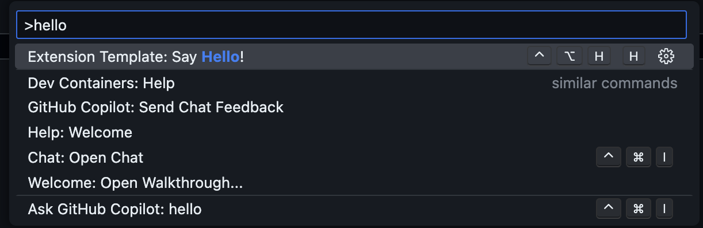

# Calva Power Tools

TBD...

## Development

The paved path is:

1. `npm run watch`. This starts Clojure with an nREPL server.
   * Wait for it to report something like:
     ```
     nREPL server started on port 56749 on host localhost - nrepl://localhost:56749
     ```
1. <kbd>ctrl+alt+c ctrl+alt+c</kbd>. This runs the command: **Calva: Connect to a Running REPL Server in the Project**
   * It will connect the Clojure REPL, start a ClojureScript (shadow-cljs) REPL, and build the extension.
   * This will compile the extension and run the tests. Wait for the **Build+watch extension** to show that the tests have ran, and for Calva to pop up a progress dialog looking something like so:
     
   * Hint: _The ClojureScript app is your extension_.
1. <kbd>F5</kbd>. This starts the VS Code _Development Extension Host_ (because configured to do so in [.vscode/launch.json](.vscode/launch.json))
   * The development extension host is a VS Code window where your extension under development is installed. You now need to activate it to actually start the ClojureScript app.
1. In the extension development host <kbd>cmd/ctrl+shift+p</kbd>, find and run the command **Extension template: Say hello!**
   
   * This activates your extension and starts the ClojureScript app and its REPL
1. Back in the development project you will see the progress dialog go away. Because now the development project window is connected to the Development Extension Host window's REPL.
      * Now you can hack on the extension code, which will update the app in the extension host window while it is running (a.k.a. interactive programming).

The important thing to note here is the steps where you activate your extension in the development host, starting the ClojureScript repl which Calva can connect to. Depending on the extension you build, it may be that it activates automatically, or by some specific file appearing or whatever. The point is that your extension needs to be activated for Calva to connect to it, and that starting the development host is often not enough to start your extension.


## Hacking on your extension

TBD...

### Publishing your extension

Thus possibly involves carrying out the steps at [create your own organization](https://learn.microsoft.com/azure/devops/organizations/accounts/create-organization)

TBD...

## Who built this?

My name is Peter Strömberg, a.k.a. [PEZ](https://github.com/PEZ). I love Clojure and VS Code, and I love to build things. I created Calva, an extension for working with Clojure in VS Code. I also co-created Joyride, a scripting environment for VS Code that lets you extend the editor in user space (i.e. without creating an extension). I've also created [Paste Replace](https://marketplace.visualstudio.com/items?itemName=betterthantomorrow.paste-replaced), and a whole bunch of Joyride scripts, big and small (mostly small).

I created this template because I want to share what I have figured out about building and maintaining extensions for VS Code. To me it is the most fun and rewarding way to spend my time, and I want you to have as much fun as I get. 😄 Calva is mostly built with TypeScript, and I'd like to contribute to you building your extensions in a more civilized programming language. Because ClojureScript is much, much, more fun than TypeScript.

That said, the workflow and automation used in the template are used for Calva, as well as with my pure ClojureScript extensions, so if you find the rest of the automation in this template useful, you can most definitely use it with a TypeScript tool chain.

## License

MIT

Free to use, modify and redistribute as you wish. 🍻🗽

## Sponsor my open source work ♥️

That, said, you are welcome to show me you like my work using this link:

* https://github.com/sponsors/PEZ
